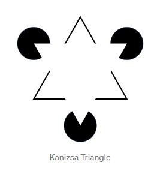

## **Nicolás Contreras**

Estudainte de novena matrícula, con un fugaz acercamiento a la materia mediante Unity.

### **Pasatiempos**
- Ir al gimnasio.
- Cocinar.
- Escuchar música.
- Echar la siesta.

### **Experiencias con los leguajes usados en la materia**

- Java y JavaScript para el desarrollo de aplicaciones web.
- Processing al realizar un proyecto de la asignatura Programación Orientada a Objetos.

### **Intereses**

1. Desarrollo de software.
2. Bases de datos.

## **Ilusión de Kanizsa**

El Triángulo de Kanizsa es una ilusión óptica descrita por primera vez por el psicólogo italiano Gaetano Kanizsa en 1955. En la figura se percibe un triángulo equilátero blanco, pero de hecho no existe ninguno. Este efecto es conocido como contorno subjetivo o ilusorio. También, este triángulo blanco inexistente parece ser más brillante que el área circundante pero, de hecho, tiene el mismo brillo del fondo.

<p align="center">
  
</p>

[//]: # (//)

### **Contornos ilusorios**

O contornos subjetivos son ilusiones ópticas que evocan la percepción de una era sin luminancia o cambio de color dentro del borde. El brillo ilusorio y su profundidad ordenados son frecuentemente acompañados de contornos ilusorios. Friedrich Schumann es a menudo acreditado con el descubrimiento de los contornos ilusorios alrededor de los principios del siglo veinte, sin embargo los contornos ilusorios son presentados en un arte de citar a las Edades Medias. La hoja Científica Americana de Gaetano Kanizsa escrita en 1976 marca el resurgimiento de interés en los contornos ilusorios por científicos de visión.


## **Ilusión de Kanizsa dinámica**

<br/>


```js


    Idea base tomada de https://naziafakhruddin.medium.com/creating-illusions-in-p5-js-dynamic-kanizsa-illusion-part-4-af9fe72c5ec7

    let angle = 0;
    let PI = 3.14;
    let HALF_PI = PI / 2;
    let THIRD_PI = PI / 3;

    p5.setup = function() {
      p5.createCanvas(400, 400);
    };

    p5.draw = function() {
      p5.background(255);

      //cuadrado
      p5.fill(137, 207, 240);
      p5.stroke(0,0,0);
      p5.strokeWeight(2);

      p5.push();
      p5.translate(50, 150);
      p5.rotate(HALF_PI + angle);
      p5.arc(0, 0, 80, 80, PI, HALF_PI);
      p5.pop();

      p5.push();
      p5.strokeWeight(2);
      p5.translate(150, 150);
      p5.rotate(PI - angle);
      p5.arc(0, 0, 80, 80, PI, HALF_PI);
      p5.pop();

      p5.push()
      p5.strokeWeight(2);
      p5.translate(150, 250);
      p5.rotate(HALF_PI * 3 + angle);
      p5.arc(0, 0, 80, 80, PI, HALF_PI);
      p5.pop();

      p5.push();
      p5.strokeWeight(2);
      p5.translate(50, 250);
      p5.rotate(PI * 2 - angle);
      p5.arc(0, 0, 80, 80, PI, HALF_PI);
      p5.pop();

      //triángulo
      p5.fill(255,192,203);

      p5.push();
      p5.strokeWeight(2);
      p5.translate(300, 160);
      p5.rotate(HALF_PI * 0.7 - angle);
      p5.arc(0, 0, 80, 80, THIRD_PI, 2 * PI);
      p5.pop();

      p5.push();
      p5.strokeWeight(2);
      p5.translate(250, 250);
      p5.rotate(HALF_PI * 3.32 - angle);
      p5.arc(0, 0, 80, 80, THIRD_PI, 2 * PI);
      p5.pop();

      p5.push();
      p5.strokeWeight(2);
      p5.translate(350, 250);
      p5.rotate(PI - angle);
      p5.arc(0, 0, 80, 80, THIRD_PI, 2 * PI);
      p5.pop();

      angle += 0.009;
  };

```

Note that `p5` should be the name to be used for the sketch object variable.



<br/>

<div align = "center">

  

    let angle = 0;
    let PI = 3.14;
    let HALF_PI = PI / 2;
    let THIRD_PI = PI / 3;

    p5.setup = function() {
      p5.createCanvas(400, 400);
    };

    p5.draw = function() {
      p5.background(255);

      //cuadrado
      p5.fill(137, 207, 240);
      p5.stroke(0,0,0);
      p5.strokeWeight(2);

      p5.push();
      p5.translate(50, 150);
      p5.rotate(HALF_PI + angle);
      p5.arc(0, 0, 80, 80, PI, HALF_PI);
      p5.pop();

      p5.push();
      p5.strokeWeight(2);
      p5.translate(150, 150);
      p5.rotate(PI - angle);
      p5.arc(0, 0, 80, 80, PI, HALF_PI);
      p5.pop();

      p5.push()
      p5.strokeWeight(2);
      p5.translate(150, 250);
      p5.rotate(HALF_PI * 3 + angle);
      p5.arc(0, 0, 80, 80, PI, HALF_PI);
      p5.pop();

      p5.push();
      p5.strokeWeight(2);
      p5.translate(50, 250);
      p5.rotate(PI * 2 - angle);
      p5.arc(0, 0, 80, 80, PI, HALF_PI);
      p5.pop();

      //triángulo
      p5.fill(255,192,203);

      p5.push();
      p5.strokeWeight(2);
      p5.translate(300, 160);
      p5.rotate(HALF_PI * 0.7 - angle);
      p5.arc(0, 0, 80, 80, THIRD_PI, 2 * PI);
      p5.pop();

      p5.push();
      p5.strokeWeight(2);
      p5.translate(250, 250);
      p5.rotate(HALF_PI * 3.32 - angle);
      p5.arc(0, 0, 80, 80, THIRD_PI, 2 * PI);
      p5.pop();

      p5.push();
      p5.strokeWeight(2);
      p5.translate(350, 250);
      p5.rotate(PI - angle);
      p5.arc(0, 0, 80, 80, THIRD_PI, 2 * PI);
      p5.pop();

      angle += 0.009;
    }
  

</div>

tema de hugo https://themes.gohugo.io/